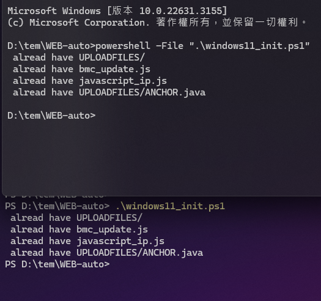

# Consensus
This is an automatic test BMC written using playwright

The file `dev_record.md` is all my development process
1. development process
2. problems encountered and solve them

+ The folder `note/` put all my test code or development stuff etc.  📜📄📑📚🧾🗒️📝
+ The folder `pic/` put all mp4 mp3 gif png etc. 🎬

[set playwright environment](http://sd20-server.aewin.com:3000/_67u42-XQvisBUMef1VGeQ)

---
---
# ❗necessary file ( developer  have to do ) ❗
❗❗❗❗❗❗❗🧬🧬🧬🧬🧬
### Linux
execute 
```bash
./INItialize.sh
```

### windows
+ Use **powershell** : `.\windows11_init.ps1`
```powershell
PS D:\tem\WEB-auto> .\windows11_init.ps1
```
+ if use *CMD* : 
```cmd
powershell -File ".\windows11_init.ps1"
```


---
---
[progress](./agenda.md)

---
---
###  how to use burn BMC repeatedly (only LINUX)
use command
```bash
./updateBMC.sh
```
[see more details](http://sd20-server.aewin.com:3000/7d_073JjTEiIFLKFqkMNsw)

---
