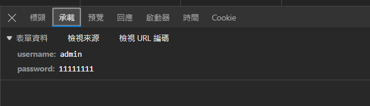
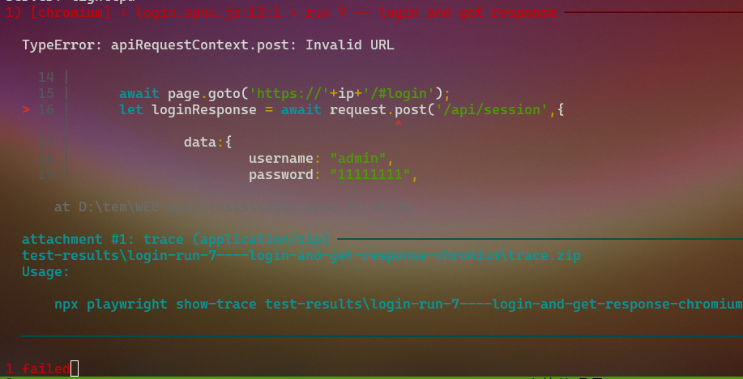
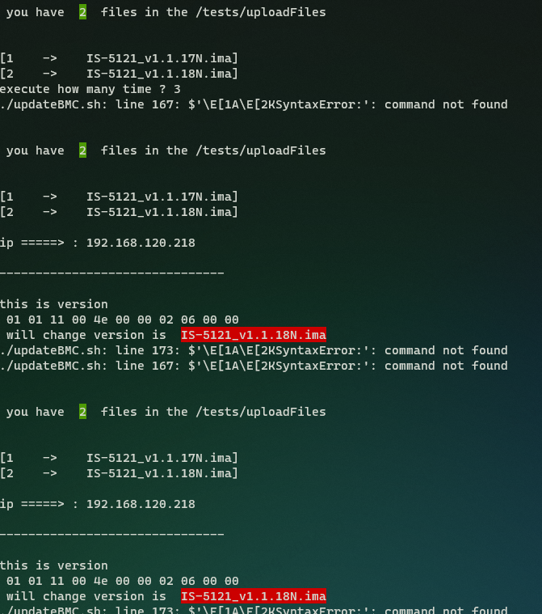

## 	ERR_CONNECTION_TIMED_OUT
if playwright output
```
Error: page.goto: net::ERR_CONNECTION_TIMED_OUT at https://192.168.120.218/#login
Call log:
  - navigating to "https://192.168.120.218/#login", waiting until "load"
```
就代表 你的機器沒開

---
## error 1 beforeALL  (test error)
#  beforeAll   XD
Error: "context" and "page" fixtures are not supported in "beforeAll" since they are created on a per-test basis.
If you would like to reuse a single page between tests, create context manually with browser.newContext(). See https://aka.ms/playwright/reuse-page for details.
If you would like to configure your page before each test, do that in beforeEach hook instead.

[ref](https://github.com/microsoft/playwright/issues/12408)
Replace beforeAll with beforeEach then it will work.

Playwright Test has context isolation by default, this means you have a new page and context for each test. By this its not possible to give you a page instance in the beforeAll hook, since there are different pages for each test. See here for more information:


---
## error: locator.isVisible : 
出問題的code
``` js
	await page.getByText('Sensor Reading ').isVisible();
```
  Error: locator.isVisible: Error: strict mode violation: 
  getByText('Sensor Reading ') resolved to 3 elements:           
 1) <h1>…</h1> 
	 aka getByRole('heading', { name: 'Sensor Reading Live reading' })                                     
 2) <li class="active">↵             
 Sensor Reading 
 </li> 
	 aka getByText('Sensor Reading', { exact: true})
 3) <div role="alert" class="alert alert-info help-item h…>…</div> aka getByText('On this page, details for all') ">

resolution : Unique element representation

---
## only title name test
[title test](https://www.youtube.com/watch?v=LTwg0kqdK4I)
```bash
npx playwright test -g "{title name}"
```
如果 你要寫一個單獨的測試
可以用 `-g` 選項
因為如果你是 只放 `test`  他預設是 全部單元測試都跑
> 就是浪費你的時間

也可以在 test.only的方式 但是 在`npx playwright test tests/{you want test file name}.spec.js`

---
## Even if there is only a button screenshot, it is still semi-transparent
如果只有2個按鈕
如果你截圖 仍然會半透明
所以只能 給他等待
我測試過 用得到元素的方式
```js
	let ldapGeneral = "false" ;
	await page.goto('https://'+ip+'/#settings/ext_users');
	await page.getByRole('link', { name: 'General Settings' }).isVisible();
	await page.screenshot({path: 'screenshot/settings/external_user_services/external_user.png',fullPage:true });
	await page.waitForTimeout(2000);
```
但是 元素的渲染速度 快過 JS的速度....==
#### resolution
` await page.waitForTimeout(2000); `
time 可以適度調整

---
## api error
當時要解決 一直 login 的問題
(因為每一次TEST 都需要登陸 原本想要用API的方式)
[api-post](https://stackoverflow.com/questions/71398892/how-to-access-response-body-correctly-when-using-playwright)
當你用API 是會一直出錯 ==
我原本看到  


```js
test('run 7 -- login and get response',async({page,request }) =>{
		await page.goto('https://'+ip+'/#login');
		/*
		   let loginResponse = await request.post('/api/session',{
		data:{
		username: "admin",
		password: "11111111",
		}
});

		 */
		//const loginResponse0 = await loginResponse.ok();
});
```
`==> TypeError: apiRequestContext.post: Invalid URL`


---
### api correct all 200
很不合理的東西
```js
let ip="192.168.120.218";
	const url = "https://192.168.120.218/#dashboard"
	await page.goto('https://'+ip+'/#login');
	await page.getByPlaceholder('Username').fill('admin');
	////await page.getByPlaceholder('Username').press('Tab');
	await page.waitForTimeout(500);
	await page.getByPlaceholder('Password', { exact: true }).fill('11111110');
	await page.waitForTimeout(500);
	await page.getByRole('button', { name: 'Sign me in' }).click();
	const res = await page.request.get(url);
	console.log(res);
```
```
==>
APIResponse: 200 OK
Content-Encoding: gzip
X-Frame-Options: SAMEORIGIN
Cache-Control: no-store, no-cache, must-revalidate, private
Pragma: no-cache
X-Content-Type-Options: nosniff
X-XSS-Protection: 1; mode=block
Referrer-Policy: no-referrer
Content-Security-Policy: default-src 'self';object-src 'none';connect-src 'self' ws: wss:;style-src 'self';script-src 'self'; img-src 'self' blob:;frame-ancestors 'self';font-src 'self'
Strict-Transport-Security: max-age=31536000; includeSubDomains; preload
Content-Type: text/html
Accept-Ranges: bytes 
ETag: "2683747453" 
Last-Modified: Fri, 08 Dec 2023 04:04:30 GMT 
Content-Length: 1164
Connection: close
Date: Mon, 08 Jan 2024 05:42:46 GMT
Server: lighttpd
2 passed (15.4s)
```
我故意用錯 但是在API 卻顯示 `200`

---
## if screenshot no suffix png error
```js
 Error: path: unsupported mime type "null"
   302 |     await page.goto('https://'+ip+'/#settings/pam_order');
   303 |     await page.waitForTimeout(900);
 > 304 |     await page.screenshot({path: 'screenshot/settings/pam_order',fullPage:true});
       |                ^
```
#### solution add suffix
` await page.screenshot({path: 'screenshot/settings/pam_order.png',fullPage:true});`


---
##  error : User Manangement 
[basic-origin](https://www.youtube.com/watch?v=bgxQ3PXJdIM&list=PL6flErFppaj0iQG2_Dd72Jz0bfrzZwMZH&index=11)
這個是他有選擇的選單

有抓到重點嗎?
我擔心元素會有其他
所以我需要 把元素抓下來
可以看到 source code
```html
<form class="form-inline">
<div class="form-group" %%feature="" %%runtime-feature="">
<label for="group_by_channel">Channel </label>
	<select name="group_by_channel" id="idgroup_by_channel" class="form-control">
		<option value="1">1</option>
		<option value="2">2</option>
		<option value="7">7</option>
	</select>
</div> 
</form>
```

TypeError: Cannot read properties of null (reading '$$')
```js
test('run 18',async({page}) => {
	await page.goto('https://'+ip+'/#settings/users');
	await page.waitForTimeout(900);
	//await page.screenshot({path: 'screenshot/settings/video/video.png',fullPage:true});
	let LoveLayer = await page.$('#idgroup_by_channel');
	console.log("lovelayer : " + LoveLayer);
	console.log(typeof(LoveLayer));
	console.log("--------------------");
	let allElements = await LoveLayer.$$("option");
	console.log("allelements ====> " + allElements);
	console.log(typeof(allElements));
	let i=0;
	for(let i=0;i<allElements.length;i++){
		let element = allElements[i];
		let LoveValue = await element.textContent();
		console.log("Value from dropdown using for loop : " + LoveValue);
	}
});
```
`name=group_by_channel` is 	*error* => `Lovelayer : null`
`id="idgroup_by_channel` is	*correct* => `LoveLayer : JSHandle@node`
~~我還不太確定... `JSHandle@node`~~

> ID 對於網頁 是 唯一標示喔

### DF : `page.$`
`page.$ `
is a method in Playwright 
that selects the first element on the current page 
that matches the specified selector.
 
let LoveLayer = await page.$('#idgroup_by_channel');
selects the element with ID idgroup_by_channel 
and stores it in a variable named LoveLayer.
 
let allElements = await LoveLayer.$$("option");
will select all elements in the LoveLayer element 
that match the option selector and store them in a variable named allElements

---
#  request  api
Wed Jan 10 11:05:28 CST 2024
[api -first](https://stackoverflow.com/questions/71398892/how-to-access-response-body-correctly-when-using-playwright)
```js
const { request } = require('@playwright/test');
const { test,expect } = require('@playwright/test');
let ip="192.168.120.218";
test.beforeEach('login', async({page,request})=>{
	const loginResponse = await request.post('https://'+ip+'/api/session' , {
		data : {
		username:"admin",
		password:"1111111",
		}
	});	
	console.log(loginResponse);
});
```
對我來說終於有成功了
可以用POST 的方式 

---
## api  in webtool
```diff
--- login-error.txt	2024-01-10 14:43:17.516459800 +0800
+++ login-correct.txt	2024-01-10 14:43:14.481453000 +0800
@@ -3,7 +3,7 @@
 Accept-Encoding: gzip, deflate, br
 Accept-Language: zh-TW,zh;q=0.9,en;q=0.8,en-GB;q=0.7,en-US;q=0.6
 Connection: keep-alive
-Content-Length: 30
+Content-Length: 32
 Content-Type: application/x-www-form-urlencoded; charset=UTF-8
 Cookie: QSESSIONID=4f783e0f3a2236dc19dTYAlUQOxY4u; selected_lang=en-us; lang=en-us
 Host: 192.168.120.218
```
這是 request head
上面的差距 只有 密碼不同
所以我就在看 playwright 可以按完後 
如何得到他的 response!!
這就是為什麼我需要 
目的: 看是否登入!

---
### use request.post (correct vs error password )
```
	const loginResponse0 = await request.post('https://'+ip+'/api/session' , {
		data : {
			username:"admin",
			password:"11111111",
		}
		});	
	const loginResponse1 = await request.post('https://'+ip+'/api/session' , {
		data : {
			username:"admin",
			password:"0111011",
		}
		});	
	console.log(loginResponse0);
	console.log("------");
	console.log(loginResponse1);
```
result:  same 

---
##   login error pass api
###   login error because delete beforeall ...(?
[莫名其妙的 虛假技術==](https://stackoverflow.com/questions/70262213/playwright-before-each-for-all-spec-files)
有出問題  因為 現在登入 直接出問題 (應該說前面 登入後 不能繼續使用)
可能是 我把 beforeAll (就算 沒有 code...) ==
我就在看 fixture.js 的方式 結果
```js
Error: Cannot find module 'fixture.js'
Require stack:
- D:\tem\WEB-auto\tests\new.spec.js
- D:\tem\WEB-auto\node_modules\playwright\lib\transform\transform.js
- D:\tem\WEB-auto\node_modules\playwright\lib\common\config.js
- D:\tem\WEB-auto\node_modules\playwright\lib\reporters\json.js
- D:\tem\WEB-auto\node_modules\playwright\lib\reporters\html.js
- D:\tem\WEB-auto\node_modules\playwright\lib\runner\reporters.js
- D:\tem\WEB-auto\node_modules\playwright\lib\runner\runner.js
- D:\tem\WEB-auto\node_modules\playwright\lib\cli.js
- D:\tem\WEB-auto\node_modules\playwright\cli.js
- D:\tem\WEB-auto\node_modules\@playwright\test\cli.js

   at new.spec.js:6

     4 | const { request } = require('@playwright/test');
     5 | //const { response } = require('@playwright/test');
   > 6 | const {newTest} = require('fixture.js');
```
	
#### solution 
```js
test.beforeEach('login', async({page,request })=>{
	const response = await request.post("https://"+ip+"/api/session",{
		data:{
			"username":"admin",
			"password":"11111111",
		}
	});
});
```
因為我再用 login api 所以他直接 無法再同個登入 資訊
就算是正確的 username && password

---
## how to capture requests and responses in playwright after hitting a button?
[ref](https://stackoverflow.com/questions/67434530/how-to-capture-requests-and-responses-in-playwright-after-hitting-a-button)
`const response = await page.waitForRequest(url => url.url().includes('templateFrom3rdRedirect'));`
`'templateFrom3rdRedirect'` : is the part of URL unique

---
## javascript import and export
[js import export](https://github.com/microsoft/playwright/issues/13959)
[ export](https://developer.mozilla.org/en-US/docs/Web/JavaScript/Reference/Statements/export)
> Every module can have two different types of export, named export and default export

i need a core to control all  `*.spec.js` --> (this is palywright test )

---
##   bash case
```bash
case "${validate_ip}" in
	yes|Yes|Y|y|0)
		echo " double check ======================>  ${ip} ";
		ip_flag=0;
		;;
	*)
		echo "plz redo " ;
		;;
esac
```
> Bash 語句只接受一次值，然後多次測試該值。
> 一旦找到模式就執行與其連結的語句,它將停止搜索模式,這與C語句幾乎相反

> The case statement simplifies complex conditions with multiple different choices. This statement is easier to maintain and more readable than nested if statements[.](https://phoenixnap.com/kb/bash-case-statement)

---
## bash function
[ref](https://linuxize.com/post/bash-functions/)
我只能用  `function_name() { command };`
> if recall need to use only name
>> didn't use [parentheses](http://www.blairenglish.com/exercises/technology_web/exercises/computer_code_symbols_signs_names_1/computer_code_symbols_signs_names_1.html)

## bash for loop
[ref](https://stackoverflow.com/questions/49110/how-do-i-write-a-for-loop-in-bash)

## bash read
[ref](https://phoenixnap.com/kb/bash-read)
`read -p " {you want put something } " ${variable} `
當時記得在一大堆資料中
為什麼用這樣的方式
因為他給使用者 更直觀的方式
make code clear!!!!


## bash  if else 
[ref](https://www.delftstack.com/zh-tw/howto/linux/how-to-use-if-else-statement-in-bash/)
```bash
if [ condition ]
then ==> important
else ==> option
fi
```

##  bash while $va1 -ne $va2
[ref](https://stackoverflow.com/questions/27209605/comparing-two-variables-in-while-loop-bash)
```bash
while [ ${limit_count} -gt 2 ]
do 
	#rm -v 
	echo -e "only 2 file u need to delete some file \n    y=>yes delete\n    n=>no  delete"
	for file_n in $(ls ./tests/uploadFiles)
	do
		rm -vi ./tests/uploadFiles/${file_n};
		limit_count=$(ls ./tests/uploadFiles/ |wc -l);
	done
done
```

## want use ipmitool and check this command success
```bash
while [ ${ipmitool_check} -gt 0 ]
do
	sleep 5;
	ipmitool_count=$((${ipmitool_count}-1));
		need_version=$(echo "${catch_version}"|cut -c 1-13);
		ipmitool_check=$?;
	if [ ${ipmitool_count} -eq 1 ]
	then
		echo " IP ERROR OR BMC not working ";
		exit 1314520;
	fi
	if [ ${ipmitool_check} -eq 0 ]
	then
		echo " ok --> 200 --> catch the bmc version " ;
		ipmitool_count=0;
	else
		echo " XX --> 401 --> error ERROR where bmc ? " ;
	fi
done
```
But I didn’t use this method later.
First, because I didn’t succeed in using the loop method.
It may be because of the problem of ipmitool.
It should be said that it can return exit code to bash in some places.

## asc art code => by art
[ref](https://stackoverflow.com/questions/1378274/in-a-bash-script-how-can-i-exit-the-entire-script-if-a-certain-condition-occurs)
```bash
if [ ${ipmitool_check} -ne 0 ]
then
#	       echo "==================================";
#	echo  "==================================|   You're got some big problems!|\n|  1. It's BMC problem \n  2. It's an IP problem \n"; exit 1;
	echo  "=================================";
	echo  "|You're got some big problems!  |";
	echo  "|  1. It's BMC problem          |";
	echo  "|    --check bmc is on          |";
	echo  "|  2. It's an IP problem        |"; 
	echo  "|    --check ip is correct      |";
	echo  "=================================";
	exit 1;
fi
```

## bash because add feature : can use same IP address 
```bash
ip="";
validate_ip="";
ip_flag=1;
origin_ip="";
#origin_ip=cat ./test.js|grep "let"|cut -d ' ' -f 2 ;
origin_ip=$(cat ./javascript_ip.js|grep "let"|cut -d ' ' -f 3) ;
catch_version="";
need_version="";
set_ip(){
use_file_ip=2;	# 0=> continue  1=>change
use_file_ip_flag=1; #
echo -e "The initial IP  :  ${origin_ip} \n\n";
while [ ${use_file_ip_flag} == 1 ]
do
	read -p "Do you want to continue useing this IP?  press \"y\" or \"n\" " use_file_ip ;
	case "${use_file_ip}" in 
		y|yes|Y|YES)
			use_file_ip_flag=0;
			ip_flag=0;
			ip=${origin_ip};
			#ip=$(echo ${origin_ip}|cut -d " 1)
			#echo ${origin_ip}|cut -d \" 2
			;;
		n|no|N|No)
			use_file_ip_flag=0;
			;;
		*)
			;;
	esac
done
```

because  origin_ip
``` bash
#{{
===> error
The initial IP  :  ip="192.168.120.218"
Do you want to continue useing this IP?  press "y" or "n" y                                                         
cut: you must specify a list of bytes, characters, or fields
Try 'cut --help' for more
information.
double check ======================>  ip="192.168.120.218"
you have  2  files in the /tets/uploadFiles
[1    ->    IS-5121_v1.1.17N.ima]
[2    ->    IS-5121_v1.1.18N.ima]
ip =====> : ip="192.168.120.218"
Address lookup for ip="192.168.120.218" failed
Could not open socket!
Error: Unable to establish IPMI v2 / RMCP+ session
#}}}
```
first look at `The initial IP : ip="192.168.120.218"`
當然如果是我在 重寫IP的時候沒問題 所以問題出在 他的結構
包含了 非ip的部分
所以修改了

```bash
ip="";
validate_ip="";
ip_flag=1;
origin_ip="";
#origin_ip=cat ./test.js|grep "let"|cut -d ' ' -f 2 ;
#origin_ip=$(cat ./javascript_ip.js|grep "let"|cut -d ' ' -f 3) ;
origin_ip=$(cat ./javascript_ip.js|grep "let"|cut -d ' ' -f 3|sed 's/"//g'|sed 's/ip=//g') ;
catch_version="";
need_version="";
set_ip(){
use_file_ip=2;	# 0=> continue  1=>change
use_file_ip_flag=1; #
echo -e "The initial IP  :  ${origin_ip} \n\n";
while [ ${use_file_ip_flag} == 1 ]
do
	read -p "Do you want to continue useing this IP?  press \"y\" or \"n\" " use_file_ip ;
	case "${use_file_ip}" in 
		y|yes|Y|YES)
			use_file_ip_flag=0;
			ip_flag=0;
			ip=${origin_ip};
			#ip=$(echo ${origin_ip}|cut -d " 1)
			#echo ${origin_ip}|cut -d \" 2
			;;
		n|no|N|No)
			use_file_ip_flag=0;
			;;
		*)
			;;
	esac
done
```
這是修正的version
就把結構變成單純的值
害我嚇爛 想說怎麼了==

### expand issus --because ip struct
```bash
./updateBMC.sh: line 173: $'\E[1A\E[2KSyntaxError:': command not found
./updateBMC.sh: line 167: $'\E[1A\E[2KSyntaxError:': command not found
```

issue: `ip=ip=ip="0.0.0.0""`
解決辦法在  {## bash_because_add_feature_can_use_same_IP_address.md} 是一樣的 


## bash if no do something raise token fi
```
if [  "${catch_version}" == "${ipmitool_check}" ]
then

fi
```
```bash
output=========>
./updateBMC.sh: line 128: syntax error near unexpected token `fi'
./updateBMC.sh: line 128: `fi'
```

## bash script can't use $?
```bash
catch_version=$(ipmitool -I lanplus -H "${ip}" -U admin -P 11111111 raw 0x1e 0x01 0x00);
ipmitool_check="";
if [  "${catch_version}" == "${ipmitool_check}" ]
then
	echo -e "=================================\n|You're got some big problems!  |\n|  1. It's BMC problem          |\n|    --check bmc is on          |\n|  2. It's an IP problem        |\n|    --check ip is correct      |\n================================="; exit 1314520;
	fi
```
```bash
if [ ${ipmitool_check} -ne 0 ]
then
#	       echo "==================================";
#	echo -e "==================================|   You're got some big problems!|\n|  1. It's BMC problem \n  2. It's an IP problem \n"; exit 1;
	echo -e "=================================\n|You're got some big problems!  |\n|  1. It's BMC problem          |\n|  2. It's an IP problem        |\n================================="; exit 1;
fi
```
so I use different ways to verify

## bash function didnt use functionname()
```bash
### error use
#set_ip();
#set_bmc();
#catch_ver();
### correct use
set_ip;
```

## bash different function variable and can span function and not 
雖然我做function 
但是在變數的地方卻可以同時用
bash 是用設定的方式來設定變數
所以他可以同步使用

---


