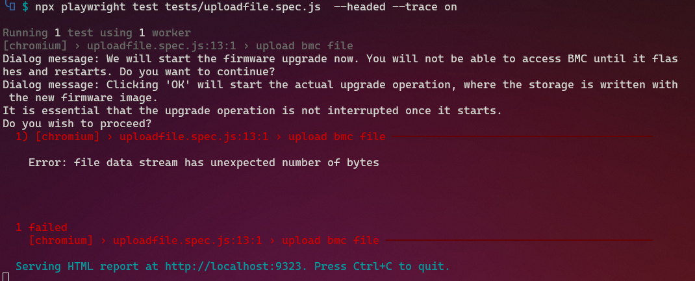
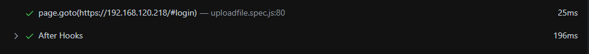

## 	ERR_CONNECTION_TIMED_OUT
if playwright output
```
Error: page.goto: net::ERR_CONNECTION_TIMED_OUT at https://192.168.120.218/#login
Call log:
  - navigating to "https://192.168.120.218/#login", waiting until "load"
```
This means your machine is not powered on

---
## error 1 beforeALL  (test error)
#  beforeAll   XD
Error: "context" and "page" fixtures are not supported in "beforeAll" since they are created on a per-test basis.
If you would like to reuse a single page between tests, create context manually with browser.newContext(). See https://aka.ms/playwright/reuse-page for details.
If you would like to configure your page before each test, do that in beforeEach hook instead.

[ref](https://github.com/microsoft/playwright/issues/12408)
Replace beforeAll with beforeEach then it will work.

Playwright Test has context isolation by default, this means you have a new page and context for each test. By this its not possible to give you a page instance in the beforeAll hook, since there are different pages for each test. See here for more information:

---
## error: locator.isVisible : 
issues code
``` js
	await page.getByText('Sensor Reading ').isVisible();
```
  Error: locator.isVisible: Error: strict mode violation: 
  getByText('Sensor Reading ') resolved to 3 elements:           
 1) <h1>…</h1> 
	 aka getByRole('heading', { name: 'Sensor Reading Live reading' })                                     
 2) <li class="active">↵             
 Sensor Reading 
 </li> 
	 aka getByText('Sensor Reading', { exact: true})
 3) <div role="alert" class="alert alert-info help-item h…>…</div> aka getByText('On this page, details for all') ">

resolution : Unique element representation

---
## only title name test
[title test](https://www.youtube.com/watch?v=LTwg0kqdK4I)
```bash
npx playwright test -g "{title name}"
```
if you want to write a single test
you can use the `g` option
because if you only put `test`,the default is to run all unit tests.
> just a waste of your time

also available in test.only but in `npx playwright test tests/{you want test file name}.spec.js`

---
## Even if there is only a button screenshot, it is still semi-transparent
if you take a screenshot  of the big button,
it weill still be translucent
so It can only wait.
I tested it by getting the element.
```js
	let ldapGeneral = "false" ;
	await page.goto('https://'+ip+'/#settings/ext_users');
	await page.getByRole('link', { name: 'General Settings' }).isVisible();
	await page.screenshot({path: 'screenshot/settings/external_user_services/external_user.png',fullPage:true });
	await page.waitForTimeout(2000);
```
however,the rendering sped of elements is faster than the speed of JS
#### resolution
` await page.waitForTimeout(2000); `
time can be adjusted appropriately

---
## api error
at that time, we had to solve the problem of always logging in
(because every TEST requires logging in,
and we originally wanted to use the API method)
[api-post](https://stackoverflow.com/questions/71398892/how-to-access-response-body-correctly-when-using-playwright)
when you use API, you will always encounter errors.
what i saw originally


```js
test('run 7 -- login and get response',async({page,request }) =>{
		await page.goto('https://'+ip+'/#login');
		/*
		   let loginResponse = await request.post('/api/session',{
		data:{
		username: "admin",
		password: "11111111",
		}
});

		 */
		//const loginResponse0 = await loginResponse.ok();
});
```
`==> TypeError: apiRequestContext.post: Invalid URL`


---
### api correct all 200
very unreasonable thing
```js
let ip="192.168.120.218";
	const url = "https://192.168.120.218/#dashboard"
	await page.goto('https://'+ip+'/#login');
	await page.getByPlaceholder('Username').fill('admin');
	////await page.getByPlaceholder('Username').press('Tab');
	await page.waitForTimeout(500);
	await page.getByPlaceholder('Password', { exact: true }).fill('11111110');
	await page.waitForTimeout(500);
	await page.getByRole('button', { name: 'Sign me in' }).click();
	const res = await page.request.get(url);
	console.log(res);
```
```
==>
APIResponse: 200 OK
Content-Encoding: gzip
X-Frame-Options: SAMEORIGIN
Cache-Control: no-store, no-cache, must-revalidate, private
Pragma: no-cache
X-Content-Type-Options: nosniff
X-XSS-Protection: 1; mode=block
Referrer-Policy: no-referrer
Content-Security-Policy: default-src 'self';object-src 'none';connect-src 'self' ws: wss:;style-src 'self';script-src 'self'; img-src 'self' blob:;frame-ancestors 'self';font-src 'self'
Strict-Transport-Security: max-age=31536000; includeSubDomains; preload
Content-Type: text/html
Accept-Ranges: bytes 
ETag: "2683747453" 
Last-Modified: Fri, 08 Dec 2023 04:04:30 GMT 
Content-Length: 1164
Connection: close
Date: Mon, 08 Jan 2024 05:42:46 GMT
Server: lighttpd
2 passed (15.4s)
```
I used it incorrectly on purpose,
but it showed `200` in the API

---
## if screenshot no suffix png error
```js
 Error: path: unsupported mime type "null"
   302 |     await page.goto('https://'+ip+'/#settings/pam_order');
   303 |     await page.waitForTimeout(900);
 > 304 |     await page.screenshot({path: 'screenshot/settings/pam_order',fullPage:true});
       |                ^
```
#### solution add suffix
` await page.screenshot({path: 'screenshot/settings/pam_order.png',fullPage:true});`


---
##  error : User Manangement 
[basic-origin](https://www.youtube.com/watch?v=bgxQ3PXJdIM&list=PL6flErFppaj0iQG2_Dd72Jz0bfrzZwMZH&index=11)
this is a selective menu

have you caught the point?
I'm worried that there will be other elements
so I need to grap the element
you can see the source code
```html
<form class="form-inline">
<div class="form-group" %%feature="" %%runtime-feature="">
<label for="group_by_channel">Channel </label>
	<select name="group_by_channel" id="idgroup_by_channel" class="form-control">
		<option value="1">1</option>
		<option value="2">2</option>
		<option value="7">7</option>
	</select>
</div> 
</form>
```

TypeError: Cannot read properties of null (reading '$$')
```js
test('run 18',async({page}) => {
	await page.goto('https://'+ip+'/#settings/users');
	await page.waitForTimeout(900);
	//await page.screenshot({path: 'screenshot/settings/video/video.png',fullPage:true});
	let LoveLayer = await page.$('#idgroup_by_channel');
	console.log("lovelayer : " + LoveLayer);
	console.log(typeof(LoveLayer));
	console.log("--------------------");
	let allElements = await LoveLayer.$$("option");
	console.log("allelements ====> " + allElements);
	console.log(typeof(allElements));
	let i=0;
	for(let i=0;i<allElements.length;i++){
		let element = allElements[i];
		let LoveValue = await element.textContent();
		console.log("Value from dropdown using for loop : " + LoveValue);
	}
});
```
`name=group_by_channel` is 	*error* => `Lovelayer : null`
`id="idgroup_by_channel` is	*correct* => `LoveLayer : JSHandle@node`
~~I'm not sure... `JSHandle@node`~~

>  The ID is the only identifier for the web page.

### DF : `page.$`
`page.$ `
is a method in Playwright 
that selects the first element on the current page 
that matches the specified selector.
 
let LoveLayer = await page.$('#idgroup_by_channel');
selects the element with ID idgroup_by_channel 
and stores it in a variable named LoveLayer.
 
let allElements = await LoveLayer.$$("option");
will select all elements in the LoveLayer element 
that match the option selector and store them in a variable named allElements

---
#  request  api
Wed Jan 10 11:05:28 CST 2024
[api -first](https://stackoverflow.com/questions/71398892/how-to-access-response-body-correctly-when-using-playwright)
```js
const { request } = require('@playwright/test');
const { test,expect } = require('@playwright/test');
let ip="192.168.120.218";
test.beforeEach('login', async({page,request})=>{
	const loginResponse = await request.post('https://'+ip+'/api/session' , {
		data : {
		username:"admin",
		password:"1111111",
		}
	});	
	console.log(loginResponse);
});
```
可以用POST 的方式 
It can use the POST method.

---
## api  in webtool
```diff
--- login-error.txt	2024-01-10 14:43:17.516459800 +0800
+++ login-correct.txt	2024-01-10 14:43:14.481453000 +0800
@@ -3,7 +3,7 @@
 Accept-Encoding: gzip, deflate, br
 Accept-Language: zh-TW,zh;q=0.9,en;q=0.8,en-GB;q=0.7,en-US;q=0.6
 Connection: keep-alive
-Content-Length: 30
+Content-Length: 32
 Content-Type: application/x-www-form-urlencoded; charset=UTF-8
 Cookie: QSESSIONID=4f783e0f3a2236dc19dTYAlUQOxY4u; selected_lang=en-us; lang=en-us
 Host: 192.168.120.218
```
This is the request head
The only difference between the above is the password.
So I'm just looking at playwright after I can press
how to get his response!!
That's why I need purpose : to see if I'm logged in!

---
### use request.post (correct vs error password )
```
	const loginResponse0 = await request.post('https://'+ip+'/api/session' , {
		data : {
			username:"admin",
			password:"11111111",
		}
		});	
	const loginResponse1 = await request.post('https://'+ip+'/api/session' , {
		data : {
			username:"admin",
			password:"0111011",
		}
		});	
	console.log(loginResponse0);
	console.log("------");
	console.log(loginResponse1);
```
result:  same 

---
##   login error pass api
###   login error because delete beforeall ...(?
[莫名其妙的 虛假技術==](https://stackoverflow.com/questions/70262213/playwright-before-each-for-all-spec-files)
there is a problem because there is a problem immediately
after logging in now (it should be said that after logging in before
you can no longer use it)
I'm just looking at the results of the Fixture.js way
```js
Error: Cannot find module 'fixture.js'
Require stack:
- D:\tem\WEB-auto\tests\new.spec.js
- D:\tem\WEB-auto\node_modules\playwright\lib\transform\transform.js
- D:\tem\WEB-auto\node_modules\playwright\lib\common\config.js
- D:\tem\WEB-auto\node_modules\playwright\lib\reporters\json.js
- D:\tem\WEB-auto\node_modules\playwright\lib\reporters\html.js
- D:\tem\WEB-auto\node_modules\playwright\lib\runner\reporters.js
- D:\tem\WEB-auto\node_modules\playwright\lib\runner\runner.js
- D:\tem\WEB-auto\node_modules\playwright\lib\cli.js
- D:\tem\WEB-auto\node_modules\playwright\cli.js
- D:\tem\WEB-auto\node_modules\@playwright\test\cli.js

   at new.spec.js:6

     4 | const { request } = require('@playwright/test');
     5 | //const { response } = require('@playwright/test');
   > 6 | const {newTest} = require('fixture.js');
```
	
#### solution 
```js
test.beforeEach('login', async({page,request })=>{
	const response = await request.post("https://"+ip+"/api/session",{
		data:{
			"username":"admin",
			"password":"11111111",
		}
	});
});
```
Because I used the login API again,he could no longer log in using the same information.
Even if the username && password is correct

---
## how to capture requests and responses in playwright after hitting a button?
[ref](https://stackoverflow.com/questions/67434530/how-to-capture-requests-and-responses-in-playwright-after-hitting-a-button)
`const response = await page.waitForRequest(url => url.url().includes('templateFrom3rdRedirect'));`
`'templateFrom3rdRedirect'` : is the part of URL unique

---
## javascript import and export
[js import export](https://github.com/microsoft/playwright/issues/13959)
[ export](https://developer.mozilla.org/en-US/docs/Web/JavaScript/Reference/Statements/export)
> Every module can have two different types of export, named export and default export

i need a core to control all  `*.spec.js` --> (this is palywright test )

---
##   bash case
```bash
case "${validate_ip}" in
	yes|Yes|Y|y|0)
		echo " double check ======================>  ${ip} ";
		ip_flag=0;
		;;
	*)
		echo "plz redo " ;
		;;
esac
```
> bash staement accepts a value only once and then tests that value multiple times.
> once the pattern is found, execute the statement connected to it,
> it weill stop searching for the pattern,
> which is almost the opposite of the C statement

> The case statement simplifies complex conditions with multiple different choices. This statement is easier to maintain and more readable than nested if statements[.](https://phoenixnap.com/kb/bash-case-statement)

---
## bash function
[ref](https://linuxize.com/post/bash-functions/)
> if recall need to use only name
>> didn't use [parentheses](http://www.blairenglish.com/exercises/technology_web/exercises/computer_code_symbols_signs_names_1/computer_code_symbols_signs_names_1.html)

## bash for loop
[ref](https://stackoverflow.com/questions/49110/how-do-i-write-a-for-loop-in-bash)

## bash read
[ref](https://phoenixnap.com/kb/bash-read)
`read -p " {you want put something } " ${variable} `
at that time,I rememgered why it
was used in this way among a lot of information.
because it gives users a more intuitive way
make code clear!!!!


## bash  if else 
[ref](https://www.delftstack.com/zh-tw/howto/linux/how-to-use-if-else-statement-in-bash/)
```bash
if [ condition ]
then ==> important
else ==> option
fi
```

##  bash while $va1 -ne $va2
[ref](https://stackoverflow.com/questions/27209605/comparing-two-variables-in-while-loop-bash)
```bash
while [ ${limit_count} -gt 2 ]
do 
	#rm -v 
	echo -e "only 2 file u need to delete some file \n    y=>yes delete\n    n=>no  delete"
	for file_n in $(ls ./tests/uploadFiles)
	do
		rm -vi ./tests/uploadFiles/${file_n};
		limit_count=$(ls ./tests/uploadFiles/ |wc -l);
	done
done
```

## want use ipmitool and check this command success
```bash
while [ ${ipmitool_check} -gt 0 ]
do
	sleep 5;
	ipmitool_count=$((${ipmitool_count}-1));
		need_version=$(echo "${catch_version}"|cut -c 1-13);
		ipmitool_check=$?;
	if [ ${ipmitool_count} -eq 1 ]
	then
		echo " IP ERROR OR BMC not working ";
		exit 1314520;
	fi
	if [ ${ipmitool_check} -eq 0 ]
	then
		echo " ok --> 200 --> catch the bmc version " ;
		ipmitool_count=0;
	else
		echo " XX --> 401 --> error ERROR where bmc ? " ;
	fi
done
```
But I didn’t use this method later.
First, because I didn’t succeed in using the loop method.
It may be because of the problem of ipmitool.
It should be said that it can return exit code to bash in some places.

## asc art code => by art
[ref](https://stackoverflow.com/questions/1378274/in-a-bash-script-how-can-i-exit-the-entire-script-if-a-certain-condition-occurs)
```bash
if [ ${ipmitool_check} -ne 0 ]
then
#	       echo "==================================";
#	echo  "==================================|   You're got some big problems!|\n|  1. It's BMC problem \n  2. It's an IP problem \n"; exit 1;
	echo  "=================================";
	echo  "|You're got some big problems!  |";
	echo  "|  1. It's BMC problem          |";
	echo  "|    --check bmc is on          |";
	echo  "|  2. It's an IP problem        |"; 
	echo  "|    --check ip is correct      |";
	echo  "=================================";
	exit 1;
fi
```

## bash_because_add_feature_can_use_same_IP_address
```bash
ip="";
validate_ip="";
ip_flag=1;
origin_ip="";
#origin_ip=cat ./test.js|grep "let"|cut -d ' ' -f 2 ;
origin_ip=$(cat ./javascript_ip.js|grep "let"|cut -d ' ' -f 3) ;
catch_version="";
need_version="";
set_ip(){
use_file_ip=2;	# 0=> continue  1=>change
use_file_ip_flag=1; #
echo -e "The initial IP  :  ${origin_ip} \n\n";
while [ ${use_file_ip_flag} == 1 ]
do
	read -p "Do you want to continue useing this IP?  press \"y\" or \"n\" " use_file_ip ;
	case "${use_file_ip}" in 
		y|yes|Y|YES)
			use_file_ip_flag=0;
			ip_flag=0;
			ip=${origin_ip};
			#ip=$(echo ${origin_ip}|cut -d " 1)
			#echo ${origin_ip}|cut -d \" 2
			;;
		n|no|N|No)
			use_file_ip_flag=0;
			;;
		*)
			;;
	esac
done
```


because  origin_ip
``` bash
#{{
===> error
The initial IP  :  ip="192.168.120.218"
Do you want to continue useing this IP?  press "y" or "n" y                                                         
cut: you must specify a list of bytes, characters, or fields
Try 'cut --help' for more
information.
double check ======================>  ip="192.168.120.218"
you have  2  files in the /tets/uploadFiles
[1    ->    IS-5121_v1.1.17N.ima]
[2    ->    IS-5121_v1.1.18N.ima]
ip =====> : ip="192.168.120.218"
Address lookup for ip="192.168.120.218" failed
Could not open socket!
Error: Unable to establish IPMI v2 / RMCP+ session
#}}}
```
first look at `The initial IP : ip="192.168.120.218"`
of course, if I rewrite the IP
it will be no problem.
so the problem is that its
structure contains non-IP parts.
So modified

```bash
ip="";
validate_ip="";
ip_flag=1;
origin_ip="";
#origin_ip=cat ./test.js|grep "let"|cut -d ' ' -f 2 ;
#origin_ip=$(cat ./javascript_ip.js|grep "let"|cut -d ' ' -f 3) ;
origin_ip=$(cat ./javascript_ip.js|grep "let"|cut -d ' ' -f 3|sed 's/"//g'|sed 's/ip=//g') ;
catch_version="";
need_version="";
set_ip(){
use_file_ip=2;	# 0=> continue  1=>change
use_file_ip_flag=1; #
echo -e "The initial IP  :  ${origin_ip} \n\n";
while [ ${use_file_ip_flag} == 1 ]
do
	read -p "Do you want to continue useing this IP?  press \"y\" or \"n\" " use_file_ip ;
	case "${use_file_ip}" in 
		y|yes|Y|YES)
			use_file_ip_flag=0;
			ip_flag=0;
			ip=${origin_ip};
			#ip=$(echo ${origin_ip}|cut -d " 1)
			#echo ${origin_ip}|cut -d \" 2
			;;
		n|no|N|No)
			use_file_ip_flag=0;
			;;
		*)
			;;
	esac
done
```
這是修正的version
就把結構變成單純的值
害我嚇爛 想說怎麼了==
This is a revised version
Just turn the struct into a simple value
I was scared so I wanted to say what happened

### expand issue --because ip struct
```bash
./updateBMC.sh: line 173: $'\E[1A\E[2KSyntaxError:': command not found
./updateBMC.sh: line 167: $'\E[1A\E[2KSyntaxError:': command not found
```


issue: `ip=ip=ip="0.0.0.0""`
the solution is the same in  {## bash_because_add_feature_can_use_same_IP_address.md} 


---
## bash if no do something raise token fi
```
if [  "${catch_version}" == "${ipmitool_check}" ]
then

fi
```
```bash
output=========>
./updateBMC.sh: line 128: syntax error near unexpected token `fi'
./updateBMC.sh: line 128: `fi'
```

---
## bash script can't use $?
```bash
catch_version=$(ipmitool -I lanplus -H "${ip}" -U admin -P 11111111 raw 0x1e 0x01 0x00);
ipmitool_check="";
if [  "${catch_version}" == "${ipmitool_check}" ]
then
	echo -e "=================================\n|You're got some big problems!  |\n|  1. It's BMC problem          |\n|    --check bmc is on          |\n|  2. It's an IP problem        |\n|    --check ip is correct      |\n================================="; exit 1314520;
	fi
```
```bash
if [ ${ipmitool_check} -ne 0 ]
then
#	       echo "==================================";
#	echo -e "==================================|   You're got some big problems!|\n|  1. It's BMC problem \n  2. It's an IP problem \n"; exit 1;
	echo -e "=================================\n|You're got some big problems!  |\n|  1. It's BMC problem          |\n|  2. It's an IP problem        |\n================================="; exit 1;
fi
```
so I use different ways to verify

## bash function didnt use functionname()
```bash
### error use
#set_ip();
#set_bmc();
#catch_ver();
### correct use
set_ip;
```

---
## bash different function variable and can span function and not 
although I am making a function,
I can use it at the same time as a variable
bash uses settings to set variables
so it can be usee at the same time

---
## bash if and oifs
[ref](https://unix.stackexchange.com/questions/9496/looping-through-files-with-spaces-in-the-names)
```bash
===error  output ===>
rm: cannot remove './tests/uploadFiles/MegaRAC': No such file or directory
rm: cannot remove './tests/uploadFiles/SP-X': No such file or directory
rm: cannot remove './tests/uploadFiles/-': No such file or directory
rm: cannot remove './tests/uploadFiles/AMI': No such file or director
rm: cannot remove './tests/uploadFiles/OEM': No such file or directory
rm: cannot remove './tests/uploadFiles/Commands': No such file or directory
rm: cannot remove './tests/uploadFiles/Specification.pdf': No such file or directory
rm: cannot remove './tests/uploadFiles/MegaRAC': No such file or directory
rm: cannot remove './tests/uploadFiles/SP-X': No such file or directory
rm: cannot remove './tests/uploadFiles/REST': No such file or directory
rm: cannot remove './tests/uploadFiles/API.pdf': No such file or director
```
```bash
OIFS="$IFS"
IFS=$'\n'
for file in `find . -type f -name "*.csv"`  
do
	echo "file = $file"
	diff "$file" "/some/other/path/$file"
	read line
	done
IFS="$OIFS"

find . -type f -name "*.csv" -print0 | while IFS= read -r -d '' file; do
    echo "file = $file"
	diff "$file" "/some/other/path/$file"
	read line </dev/tty
done
```

---
## bash echo -e specail art use
only use space
```bash
## error use
if [[ ${limit_count} == 1 ]]
then
	echo -e "==============================\n| ERROR!!! need 2 file		  |\n| you only put one file      |\n==============================";
fi
```
```bash
## correct use 
if [[ ${limit_count} == 1 ]]
then
	echo -e "==============================\n| ERROR!!! need 2 file       |\n| you only put one file      |\n==============================";
fi
```

---
## bash condition
```bash
	while [ ${ip} == ${ipmitool_check} ] 
	do
read -p  " U need to input IP address : " ip;
	done
```
error : ./updateBMC.sh: line 59: [: 192.168.120.218: unary operator expected
solution
```bash
	while [[ ${ip} == ${ipmitool_check} ]]
	do
read -p  " U need to input IP address : " ip;
	done
```

---
# playwright use expect to check  login is correct
```js
1. 	//const response = await page.waitForRequest(url => url.url().includes('dashboard'));	
2.	const response = await expect(page).toHaveURL('https://'+ip+'/#dashboard');
```
1. fail : it will be stuck and raise error (in playwright)
2. success : I use expect -> Form a web design perspective

---
## playwright.locator.filter
```bash
	await page.locator('div').filter({ hasText: /^Full Flash$/ }).getByRole('insertion').click();
	//await page.locator('div').filter({ hasText: Full Flash }).getByRole('insertion').click();
```
this way is by `codegen`
need use `/^Full Flash$/`

---
## playwright page.once use to 
[playwright dialog](https://playwright.dev/docs/dialogs)
use at 3 way
1. alert()
2. confirm()
3. prompt()
```js
	page.once('dialog', dialog => {
		console.log(`Dialog message: ${dialog.message()}`);
		//dialog.dismiss().catch(() => {});
		dialog.accept().catch(() => {});
	});
```
in confirm() 
1. dismiss() 
2. accept()

---
love me hard lov3e me
do 520 you know love 
love it is omg love

love me 520

---
## playwright.issue.upload.bmc.file.after.hooks

This is explaining what went wrong
Because this is not a matter of direct instruction
but in my opinion
I think this is a different kind of programming problem.

this is the playwright last trace

The last part is also where the problem can be seen 
(in playwright result)
```bash
=====palywright error message ====>
Error: file data stream has unexpected number of bytes
```
### solution
when the last ending code of API appears
there will be a waiting time for him to restart
but this is not an accurate statement

because it should be in the WEBUI-interface
even though he received the final closing code
still need to wait for some time

so I used waiting time do solve the error
` await page.waitForTimeout(4000);`

> Even if an error is displayed,
> the update action can still proceed normally.

---
## playwright timeout of execeeded while running beforeEach hook
[ref](https://stackoverflow.com/questions/67434530/how-to-capture-requests-and-responses-in-playwright-after-hitting-a-button)
```js
	const response = await page.waitForRequest(url => url.url().includes('dashboard'));	
```
> where 'templateFrom3rdRedirect' is the part of URL unique 
> to the necessary "hop" of the last redirect

in my opinion,maybe BMC's web is not a jump
but the should have a modified the version
because I've succeeded before
now jump directly to the error 
( Mon Feb  5 10:29:00 CST 2024)

---
## optimization s and echo 
Reason analysis: What I ordered can be written, so I replaced the original writing method.
```bash
var_catch_origin="";
var_catch_origin=$(grep update bmc_update.js|cut -d ' ' -f 3|cut -d '"' -f 2);
change_file=$(ls ./UPLOADFILES/ |grep -v "${var_catch_origin}");
echo "the check $change_file}"

#echo "change_file_bash : ${change_file}";
###### grab the previous update file
orgin_update_bmc_file=$(cat ./bmc_update.js | grep "updateBMCfile"|cut -d ' ' -f 3); 
#echo "${change_file}";												#check bmc file
echo -e " will change version is  \e[41m${change_file}\e[0m"|tee -a log.txt
sed -i "s/${orgin_update_bmc_file}/updateBMCfile=\"${change_file}\"/g" ./bmc_update.js
```
I can understand something so complex,
but it seems like torture for someone not familiar with the script.
> if you want to know detial!u can go to 40181ba9d419023ac6179fbb73af6def8c6346de

#### how to fix it
```bash
#! /bin/bash
orgin_update_bmc_file=$( grep "updateBMCfile" bmc_update.js|cut -d ' ' -f 3|cut -d '"' -f 2); 
echo "${orgin_update_bmc_file}";
#echo "${change_file}";												#check bmc file
ttt="IS-520_v1.1.20N.ima";
echo -e " will change version is  \e[41m${change_file}\e[0m"|tee -a log.txt
#sed -i "s/${orgin_update_bmc_file}/updateBMCfile=\"${change_file}\"/g" ./bmc_update.js
#echo -e '// @ts-check\nexport let updateBMCfile="${ttt}"' >ttttttttt.js
echo -e "// @ts-check\nexport let updateBMCfile=\"${ttt}\"" >ttttttttt.js
```
`echo -e '// @ts-check\nexport let updateBMCfile="${ttt}"' >ttttttttt.js`
+ error : because strong ref
`echo -e "// @ts-check\nexport let updateBMCfile=\"${ttt}\"" >ttttttttt.js`
+ correct : weak ref
this is my test.sh (just test) (no git ls )

---
## playwright get  page.getByText sometimes did not work sometimes did work
```js
	await page.getByRole('button', { name: 'Sign me in' }).click();
	loginFlag = await page.getByText('Login Failed').isVisible();
	await page.waitForTimeout(1314);
	if(await page.getByText('Login Failed').isVisible()){
		console.log("========================================");
		console.log("|               ERROR    :             |");
		console.log("|             didn't login !!!         |");
		console.log("========================================");
	}
```
very surprising question
Sometimes it's normal, sometimes it's abnormal
+ correct work

+ error work 


Although the prompt text of the picture is different
But this is just a small change

I think it's because it's too fast
**no time interval**

### solution
`	await page.waitForTimeout(520); `
```js
	await page.getByRole('button', { name: 'Sign me in' }).click();
	await page.waitForTimeout(520); 
	loginFlag = await page.getByText('Login Failed').isVisible();
	await page.waitForTimeout(1314);
	if(await page.getByText('Login Failed').isVisible()){
		console.log("========================================");
		console.log("|               ERROR    :             |");
		console.log("|             didn't login !!!         |");
		console.log("========================================");
	}
```
let the page comfirm and capture the judgment-element

---
## bash alias and edit issue
[ref](https://stackoverflow.com/questions/24054154/how-do-create-an-alias-in-shell-scripts)

### first 
```bash
#!/bin/bash
shopt -s expand_aliases
alias I_am_only_ls_alias=ls
I_am_only_ls_alias
```
> Scripts usually use functions, not aliases  --Barmar

### edit issue
```bash
variable_catch_bmc="";
if [ ${variable_string_bmc} == 'ANCHOR.java' ]
then
	variable_catch_bmc=$(ls -r UPLOADFILES/ |head -n1);
	echo ${variable_catch_bmc};
	#cat bmc_update.js|edit_file 's/${variable_string_bmc}/${variable_catch_bmc}/g'
	#$(edit_file 's/${variable_string_bmc}/${variable_catch_bmc}/g' bmc_update.js)
	#### this is error didn't use single quote
	edit_file "s/${variable_string_bmc}/${variable_catch_bmc}/g" bmc_update.js
	echo "exectue edit it";
fi
```

---
## bash error - variable is null (empty)
#### issue
```bash
#var_string_bmc=$(grep ANCHOR bmc_update.js|cut -d ' ' -f 3 | cut -d '"' -f 2);
#### if the var_string_bmc : have ANCHOR that no error
#### if only grep and it is 1 but use cut and return 0
if [ "$?" == "0" ]
then
	var_string_bmc=$(grep ANCHOR bmc_update.js|cut -d ' ' -f 3 | cut -d '"' -f 2);
else
	var_string_bmc=$(grep update bmc_update.js|cut -d ' ' -f 3 | cut -d '"' -f 2);
fi

```
```bash
#var_string_bmc=$(grep ANCHOR bmc_update.js|cut -d ' ' -f 3 | cut -d '"' -f 2);
grep ANCHOR bmc_update.js;
if [ "$?" == "0" ]
then
	var_string_bmc=$(grep ANCHOR bmc_update.js|cut -d ' ' -f 3 | cut -d '"' -f 2);
else
	var_string_bmc=$(grep update bmc_update.js|cut -d ' ' -f 3 | cut -d '"' -f 2);
fi
```
So I slightly modified it to make it easier to use.
Then the error will not occur again in the future.
```bash
error output ======>

```

---
## issue : delay catch ip
This happened after 
I added new features and changed the overall architecture 
(setting up bmc files)


The issue It's facing is related to the newly added functionality and changes to the overall architecture.
Initially, the IP address is correct,
but after using the new feature,
it modifies the IP address, resulting in errors.

### solution 
Just change the time of crawling IP

---
##  bash bug : fixed value parameter errors lead to - crawling non-existent files
This is when I was writing, 
because the default was two files,
so it caused the [expected cognitive error.](https://link.springer.com/article/10.1007/s10339-007-0173-z)
> Anticipatory cognitive errors refer to faulty thinking patterns 
> that occur when individuals anticipate negative outcomes 
> or misinterpret situations based on cognitive biases.
> --bing


```bash
var_catch_bmc="";
flag_select_bmc=1;
flag_select_tem='n';
var_local_num=0;
var_locat_get_remainder=0;
var_string_optbmc="";
var_catch_all_count=0;
var_catch_all_count=$(ls UPLOADFILES/|wc -l);
if [ ${var_string_bmc} == 'ANCHOR.java' ]
then
	echo -e "Set the initial bmc updat file 'It is recommended to keep it consistent with the current BMC version'  (press y=> check)\n(press y=> check)\n";
	while [ ${flag_select_bmc} == 1 ]
	do
		var_local_num=$((var_local_num+1));
		#var_locat_get_remainder=$((${var_local_num}%2))
		var_locat_get_remainder=$((${var_local_num}%${var_catch_all_count}))
		# flex If you use `head` it will be a bit static
		var_string_optbmc=$(ls UPLOADFILES/|cut -d $'\n' -f $((${var_locat_get_remainder}+1)));
		echo ${var_string_optbmc};
		read -p " Do you want to choose this?" flag_select_tem;
		if [[ ${flag_select_tem} == 'y' ]] || [[ ${flag_select_tem} == 'yes' ]]
		then
			#echo "flag_select_tem";
			flag_select_bmc=0;
#	edit_file "as_to/${var_string_bmc}/${var_string_optbmc}/g" bmc_update.js
			#echo -e "// @ts-check\nexport let updateBMCfile=\"${var_string_optbmc}\"";
			echo -e "// @ts-check\nexport let updateBMCfile=\"${var_string_optbmc}\"">bmc_update.js
		fi
	done
fi
```

`var_locat_get_remainder=$((${var_local_num}%2))`
this will cause problems
(the situation can only be 2 files)
(I think like a bufer overflow)
`var_locat_get_remainder=$((${var_local_num}%${var_catch_all_count}))`
if use variable.that works like a charm


---
---
---
##  bash message is " Running: command not found "
```bash
		echo " !!!====> ${i}" >> log.txt;
		$(date >> log.txt)
		#$(npx playwright test tests/change.spec.js --headed|tee -a log.txt)
		$(npx playwright test tests/change.spec.js --headed>> log.txt)
		sleep 10;
		function_catch_ver;		### --> Thu Feb 22 11:36:14 CST 2024 I comment but error...this need to catch it... because the function_catch_version need to inhire it 
		$(ipmitool -I lanplus -H ${ip} -U admin -P 11111111 raw 0x1e 0x01 0x00 >> log.txt);
		$(command -v date >> log.txt)
		$(npx playwright test tests/uploadfile.spec.js --headed >> log.txt)
		sleep 2m;
		if [ ${i} -eq ${execute} ];
		then
			#echo " this is last one ";
			$(npx playwright test tests/change.spec.js --headed>> log.txt);
		fi
```
This still executes my playwright,
but it keeps erroring out....
> the error : only just say not found command

~~I call it [a scumbag program, a ruthless program, a time-space disorder program]~~


If
[use command -v](https://stackoverflow.com/questions/58388169/date-command-not-found-in-shell-script)
still error.

#### solution
and I find maybe playwrith test (and bash test ) is defferent
and tee only use linux command so I just change redirector.


---
---
---

## bash -- Retrieve the old state that caused the error to occur
```bash
limit_count=0; 														#int limit_count
#limit_count=$(ls ./tests/uploadFiles/ |wc -l)
limit_count=$(ls ./UPLOADFILES/ |wc -l)
if [[ ${limit_count} == 1 ]] ; then
	### if only one update bmc file
	echo -e "==============================\n| ERROR!!! need 2 files      |\n| you only put one file      |\n=============================="; exit 111;	
fi
for file in $(ls ./UPLOADFILES)
do
	Extension=${file##*.}
	case "${Extension}" in
		java)
			rm -v ./UPLOADFILES/$file;;
			
		ima)
			echo "";;
		*)
			rm  ./UPLOADFILES/$file;;
	esac	
done
```


There's nothing wrong with that.
Even if the non-bmc update files are deleted,
the error message still appears 
(which means an inappropriate concept).
	
Why? Because my data is not synced to
So it will cause this problem
#### solution -- just synchronize it
```bash
do
	Extension=${file##*.}
	case "${Extension}" in
		java)
			rm -v ./UPLOADFILES/$file;;
			
		ima)
			echo "";;
		*)
			rm  ./UPLOADFILES/$file;;
	esac	
done
limit_count=$(ls ./UPLOADFILES/ |wc -l);		#### Need to synchronize
```

---
---
## playwright if not use tile\_name
```js
(async () => {
	const browser = await playwright.chromium.launch();
	const context = await browser.newContext();
	const page = await context.newPage();
	await page.goto('https://www.msn.com/zh-tw/news/living/%E8%8B%97%E6%A0%97%E4%B8%89%E7%81%A39-2%E5%BA%A6-%E5%90%B3%E5%BE%B7%E6%A6%AE-%E5%86%B7%E7%A9%BA%E6%B0%A327%E6%97%A5%E7%B7%A9%E6%85%A2%E6%B8%9B%E5%BC%B1/ar-BB1iSwML?ocid=entnewsntp&pc=U531&cvid=7a9fa0386821496d8ef17397bcb84441&ei=26');

	// Important to "start" this promise before the window.open() could happen
	const newPagePromise = new Promise(resolve => context.once("page", resolve))

	// Imagine some internal window.open() logic
	await page.evaluate(() => {
		setTimeout(() => {
			window.open("https://github.com/microsoft/playwright", "_blank")
		}, 3 * 1000)
	})

	// Here we are waiting until the page has been opened
	const newPage = await newPagePromise

	// Since its a normal Page instance, we can now assert the URL of it
	console.log(newPage.url(), await newPage.title())

	await browser.close();
})();
```
```bash
=====error output=====>
unning 2 tests using 2 workers

/mnt/d/tem/WEB-auto/tests/kvm.spec.js:19
const browser = await playwright.chromium.launch();
                    ^
ReferenceError: playwright is not defined
	at /mnt/d/tem/WEB-auto/tests/kvm.spec.js:17:18
	at Object.<anonymous> (/mnt/d/tem/WEB-auto/tests/kvm.spec.js:39:2)
	at Module._compile (node:internal/modules/cjs/loader:1378:14)
	at Module.f._compile (/mnt/d/tem/WEB-auto/node_modules/playwright/lib/utilsBundleImpl.js:16:994)
	at Module._extensions..js (node:internal/modules/cjs/loader:1437:10)
	at Object.i.<computed>.ut._extensions.<computed> (/mnt/d/tem/WEB-auto/node_modules/playwright/lib/utilsBundleImpl.js:16:1010)
	at Module.load (node:internal/modules/cjs/loader:1212:32)
	at Function.Module._load (node:internal/modules/cjs/loader:1028:12)
	at Module.require (node:internal/modules/cjs/loader:1237:19)
	at require (node:internal/modules/helpers:176:18)
	at requireOrImport (/mnt/d/tem/WEB-auto/node_modules/playwright/lib/transform/transform.js:176:20)
	at loadTestFile (/mnt/d/tem/WEB-auto/node_modules/playwright/lib/common/testLoader.js:55:42)
	at InProcessLoaderHost.loadTestFile (/mnt/d/tem/WEB-auto/node_modules/playwright/lib/runner/loaderHost.js:42:20)
	at loadFileSuites (/mnt/d/tem/WEB-auto/node_modules/playwright/lib/runner/loadUtils.js:92:25)
	at Object.setup (/mnt/d/tem/WEB-auto/node_modules/playwright/lib/runner/tasks.js:195:7)
	at taskLoop (/mnt/d/tem/WEB-auto/node_modules/playwright/lib/runner/taskRunner.js:76:11)
	at TaskRunner.runDeferCleanup (/mnt/d/tem/WEB-auto/node_modules/playwright/lib/runner/taskRunner.js:93:5)
	at TaskRunner.run (/mnt/d/tem/WEB-auto/node_modules/playwright/lib/runner/taskRunner.js:48:9)
	at Runner.runAllTests (/mnt/d/tem/WEB-auto/node_modules/playwright/lib/runner/runner.js:74:24)
	at runTests (/mnt/d/tem/WEB-auto/node_modules/playwright/lib/cli.js:130:93)
	at t.<anonymous> (/mnt/d/tem/WEB-auto/node_modules/playwright/lib/cli.js:40:7)

Node.js v21.6.0
```


## playwright test is not a function
```js
test('kvm',async () => {

})();
```
```bash
=====error output ===>
TypeError: test(...) is not a function

at kvm.spec.js:39
	37 |
	38 |  await browser.close();
  > 39 | })();
           ^
	40 |
	41 |
	42 | test('test', async ({ page }) => {
		at Object.<anonymous> (/mnt/d/tem/WEB-auto/tests/kvm.spec.js:39:3)
		To open last HTML report run:

		npx playwright show-report
		}
```

#### solution -- playwright if not use tile\_name && playwright test is not a function
```js
test('kvm',async () => {

});
```

##  playwright new browser tab was opened
[ref](https://stackoverflow.com/questions/64889036/how-can-i-check-if-a-new-browser-tab-was-opened)
[ref](https://try.playwright.tech/?s=g8vb1si)
so use this can open a new button
```js
// Important to "start" this promise before the window.open() could happen
const newPagePromise = new Promise(resolve => context.once("page", resolve))

// Imagine some internal window.open() logic
await page.evaluate(() => {
		setTimeout(() => {
				window.open("https://github.com/microsoft/playwright", "_blank")
				}, 3 * 1000)
			})
```

## playwright use popup windows (need to control a new windows )
He uses Promise to capture the context
and use evaluate to open window (tab) 
so let our change it!

I use `codegen` 
[If the page opens a pop-up (e.g. pages opened by target="\_blank" links)](https://playwright.dev/docs/pages)
I find it from [playwright DOCS](https://playwright.dev/docs/)
> Although there is no 'target' method in our JavaScript,
> in Playwright, it observes actions and determines that 
> it only captures actions. So
> this approach has been successful!
```js
	const page1Promise = page.waitForEvent('popup');
	await page.getByRole('button', { name: ' Launch H5Viewer' }).click();
	// only this line is so weird because  (F08E) 
	const page1 = await page1Promise;
	await page.waitForTimeout(2000);
```

> Locators don't return promises
> only the "action" methods like 
> `.fill()` , `.click()`, `.evaluate() `
> and [so forth return promises](https://stackoverflow.com/questions/76155060/understanding-playwright-promises)


---
---
---
## playwright  error page.waitForeven : test timeout of 30000ms exceeded.
```js
====error output ===>
Error: page.waitForEvent: Test timeout of 30000ms exceeded.
=========================== logs ===========================
waiting for event "popup"
============================================================

	48 | 	await page.getByRole('button', { name: 'Sign me in' }).click();
	49 | 	await page.goto('https://'+ip+'/#remote_control');
  > 50 | 	const page1Promise = page.waitForEvent('popup');
	   | 	                          ^
	51 | 	await page.getByRole('button', { name: ' Launch H5Viewer' }).click();
	52 | 	const page1 = await page1Promise;
	53 | 	await waitForTimeout(2000);

at /mnt/d/tem/WEB-auto/tests/kvm.spec.js:50:28
```
##### solution :  add condition  
Although playwright’s official documentation states
that actions should be taken only after the element has finished loading,
this condition refers to the element’s loading process, not navigation.

`	const response = await expect(page).toHaveURL('https://'+ip+'/#dashboard');`
add condition to solution it


---
---
---
## when open using windows playwright vs open directly using a browser
because the kvm the screen is different
`note/kvm_msedge.html`
`note/kvm_playwright.html`


this is source code different part
green 	is correct screen
red		is error screen
( but I'll skip this part for now
because there are too many problems to slove
I don't have much energy )

---


