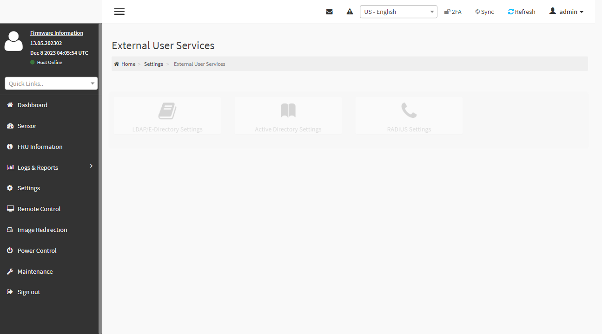

tag [[playwright]] [[page.screenshot]] [[page.waitForTimeout]]

---

## Even if there is only a button screenshot, it is still semi-transparent
如果只有2個按鈕
如果你截圖 仍然會半透明
所以只能 給他等待
我測試過 用得到元素的方式
```js
	let ldapGeneral = "false" ;
	await page.goto('https://'+ip+'/#settings/ext_users');
	await page.getByRole('link', { name: 'General Settings' }).isVisible();
	await page.screenshot({path: 'screenshot/settings/external_user_services/external_user.png',fullPage:true });
	await page.waitForTimeout(2000);
```
但是 元素的渲染速度 快過 JS的速度....==

#### resolution
` await page.waitForTimeout(2000); `
time 可以適度調整
