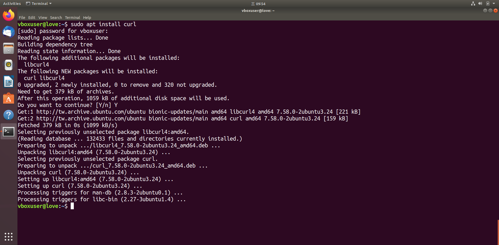
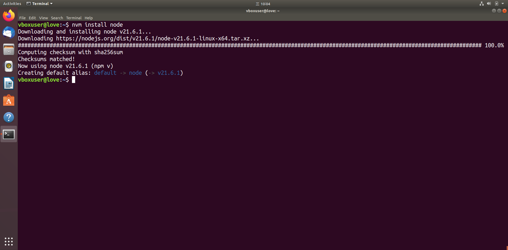
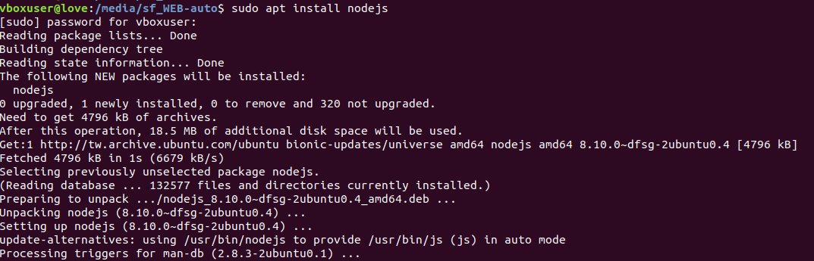
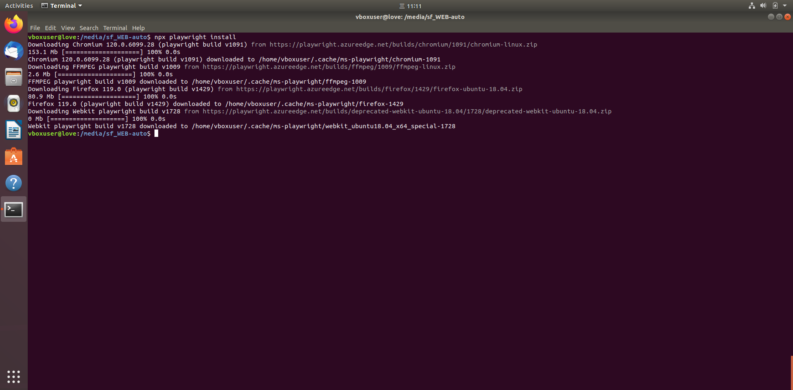

# bash
## set environment
[ref](https://www.digitalocean.com/community/tutorials/how-to-install-node-js-on-ubuntu-20-04)
[ref1](https://learn.microsoft.com/zh-tw/windows/dev-environment/javascript/nodejs-on-wsl)
## need curl tool
`sudo apt install curl`


the script can be downloaded and executed with the following :
```bash
curl -o- https://raw.githubusercontent.com/nvm-sh/nvm/v0.39.3/install.sh | bash
```

關閉terminal 在打開一次 (重新啟動一次 bash)
close terminal and 

```bash
nvm install node
```


```bash
nvm install 16.15.1
```

##  intalled nodejs  (optional)
```bash
sudo apt install nodejs
```


```bash
npx playwright install
```

## installed ipmitool
```bash
sudo apt install ipmitool
```


