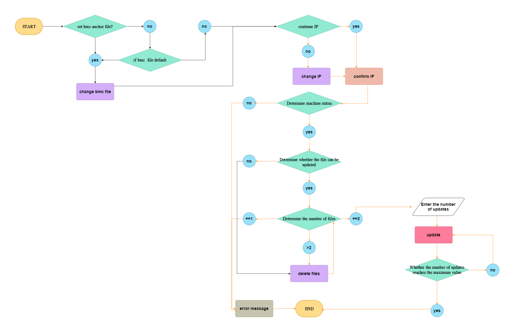

#  sop\_loop\_burn\_in\_bmc.md
# graph overview

## put update file
在 /tests/uploadFiles/ 資料夾中放入要跟新的檔案
rule :
1. 只能有 two files
2. 其中一個檔案 需要是現在BMC的版本
## check initial IP
在第一行的IP 會出現初始IP
看是否是使用者要用的IP

## 1.reuse ip 重複使用同個IP
use command `./updateBMC.sh`
需要先看看IP位址
第一行會說一開始的IP
如果使用者要重複使用 
那就輸入`y`

## 1.input IP address
如果使用者要使用
不同IP 就輸入 `n`

會給你輸入IP的地方
> 不能不輸入喔 

再來就是 還需要確認IP 是否正確
> 設計成只要簡單文字的方式
> 而不是像確認密碼再次輸入

最後會再出現 `ip =====> x.x.x.x`
的確認訊息

## if bmc not work or IP error

就會跳出這個訊息 
1. 確認BMC是開啟的
2. 確認IP正確

## 2.if file more than two file (in the rule)

如果檔案數量大於2
就會跳出互動式刪除模式

當符合RULE 就會繼續下一步

### if file only one
如果只放一個檔案 就會
直接出錯喔

### if file == 2 ( conform to the rules) && consistent with current BMC version
當符合2個檔案 就會
顯示出 你要更新的檔案
與當前版本的檔案

### if bmc version is not current version 
如果你是符合2個檔案
但是卻沒有放入當前BMC 版本

會跳出現在版本的訊息

### summarize : two file and current file
所以當你都符合規則 
1. 2個檔案
2. 符合當前version

## last how many times to burn in bmc 
最後就是決定 
燒入的次數

